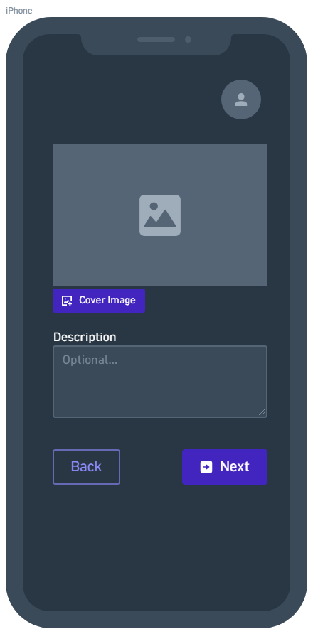
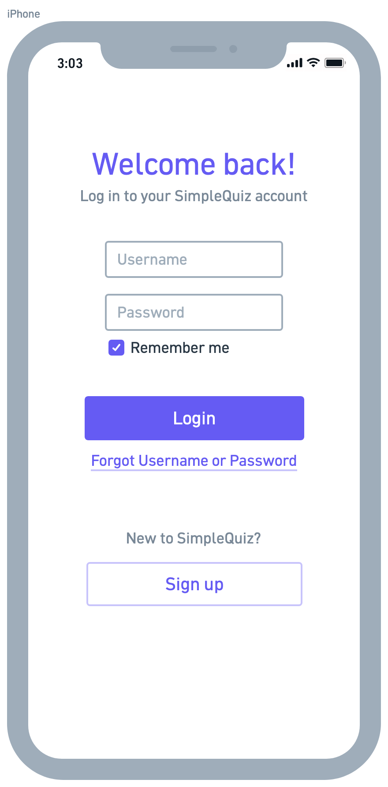

# D.2 Requirements
## 1. Positioning
### 1.1 Problem statement
### 1.2 Product Position Statement
### 1.3 Value proposition and customer segment
## 2. Functional requirements
### 2.1 Quiz management
1. [High] The system shall allow teachers to create, edit, draft, and delete quizzes.
2. [Medium] The system shall allow teachers to set quiz metadata, including title, description, and cover image.
3. [Medium] The system shall allow teachers to set quiz-level settings, including:
    * [Medium] Overall time limit.
    * [Low] Per-question time limit.
    * [Medium] Passing score threshold.
    * [Medium] Maximum allowed attempts per student.
    * [Low] Question and answer choice randomization.
4. [High] The system shall allow teachers to publish quizzes to make them accessible to students.

### 2.2 Question management
1. [High] The system shall support multiple question types, including:
    * [High] Multiple choice.
    * [Medium] Multiple select.
    * [High] True/false.
    * [Medium] Short answer.
2. [High] The system shall allow teachers to assign point values to questions.
3. [Low] The system shall allow teachers to attach multimedia assets to questions.

### 2.3 Quiz execution and submission
1. [High] The system shall display assigned quizzes and available attempts to logged-in students.
2. [Medium] The system shall display an active countdown timer during time-limited quiz attempts.
3. [Medium] The system shall automatically save student progress during an active quiz.
4. [High] The system shall automatically submit the quiz attempt when the time limit expires.
5. [High] The system shall allow students to select or enter answers for each quiz question.
6. [High] The system shall allow students toexplicitly submit their completed quiz attempts. 

### 2.4 Grading and analytics
1. [High] The system shall automatically grade objective questions upon submission.
2. [Medium] The system shall display immediate scores and feedback explanations to students post-submission if enabled by the teacher.
3. [Low] The system shall provide teachers with aggregate class performance metrics and individual student attempt details.

## 3. Non-functional requirements
## 4. MVP
## 5. Use cases
### 5.1 Use case diagram
### 5.2 Use case descriptions and interface sketch
#### 5.2.1 Use case: Create a quiz
**Actor:** Teacher  
**Description:** The teacher creates a new quiz.  
**Preconditions:** The teacher is already logged in to the system.  
**Post-conditions:** The quiz is registered in the system, but does not contain any questions yet.

**Main flow:**
1. The teacher specifies a title for the quiz.
2. The teacher instructs the system to register the new quiz.
3. The system validates the title.
4. The system registers the quiz.
5. The system informs the teacher of the success.
6. The system offers the teacher to start editing the quiz.

**Alternative flows:**
* <b> 2a. The teacher cancels the operation:</b>
    1. The system returns to the previous state.
* <b> 3a. The title is invalid because it is empty: </b>
    1. The system informs the teacher of the error.
    2. The system returns to step 1.
* <b> 4a. An error occurs while registering the quiz: </b>
    1. The system informs the teacher of the error.
    2. The system returns to step 1 while retaining the text, allowing the teacher to edit the title, try again, or cancel.

#### 5.2.2 Use case: Quiz details
**Actor:** Teacher  
**Description:** The teacher adds a cover image and description.  
**Preconditions:** The teacher is logged in and is in the process of creating or editing the quiz.  
**Post-conditions:** The cover image and/or description of the quiz are updated in the system.  

**Main flow:**
1. The teacher optionally uploads a cover image.
2. The teacher optionally provides a description for the quiz.
3. The teacher instructs the system to proceed to the next step.
4. The system validates the input data.
5. The system saves the quiz details.
6. The system advances the teacher to the next step.

**Alternative flows:**
* <b> 3a. The teacher cancels or goes back: </b>  
    1. The system returns to the previous state.  
* <b> 4a. An error occurs while uploading the image (invalid format or size limit exceeded): </b>  
    1. The system informs the teacher of the error.  
    2. The system returns to step 1 while retaining the description text, allowing the teacher to select a different image.
* <b> 4b.  An error occurs while saving the quiz details (word count exceeded): </b>  
    1. The system informs the teacher of the error.  
    2. The system returns to step 1 while retaining all entered inputs, allowing the teacher to try again.

#### 5.2.3 Use case: Log in
**Actor:** Teacher or student  
**Description:** The user authenticates with the system to access their quizzes and account features.  
**Preconditions:** The user has an account registered with the system.  
**Post-conditions:** The user is authenticated and the system displays the appropriate experience for their role.  

**Main flow:**
1. The user provides their account credentials.
2. The system validates the credentials.
3. The system authenticates the user.
4. The system starts a session for the user.
5. The system displays the appropriate teacher or student experience.

**Alternative flows:**
* <b> 2a. The credentials are invalid: </b>  
    1. The system informs the user that the credentials are invalid.
    2. The system allows the user to try again.
* <b> 2b. The account does not exist: </b>  
    1. The system informs the user that no matching account was found.
    2. The system offers the user the option to register or try again.
* <b> 2c. The user cancels the operation: </b>  
    1. The system returns the user to the previous state without creating a session.

## 6. User stories
* As a teacher, I want to see how my students did at a glance, so that I can adjust the difficulty of future quizzes. 
    * Priority:
    * Effort estimate:
* As a student, I want to get feedback instantly, so that I can learn from it more efficiently. 
    * Priority:
    * Effort estimate:
* As a teacher, I want to set a time limit for quizzes so that students can be challenged.
    * Priority: Medium
    * Effort estimate: 3
* As a student, I want to flag questions for review during the quiz, so that I can return to them before submitting.
    * Priority: Low
    * Effort estimate: 2
* As a teacher, I want to log in securely so that I can create and manage my quizzes.
    * Priority: High
    * Effort estimate: 3
* As a student, I want to log in to my account so that I can access assigned quizzes and review my results.
    * Priority: High
    * Effort estimate: 3

## 7. Issue Tracker
## 8. Member participation
* Jonas Thumbs (@Jonas-Thumbs)
* Cody Hess (@CodyHesss)
* Bella Broker (@bjb629)
* Gustavo Avina (@naugoose)
* Annabelle Rodriguez (@annabellerod)
* Gus Cardenas (@gusc839)
