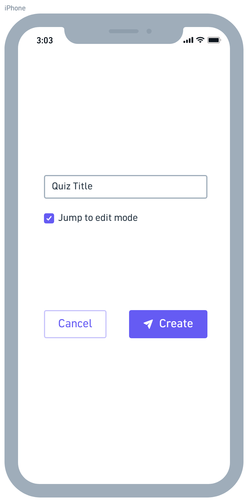

# D.2 Requirements
## 1. Positioning
### 1.1 Problem statement
### 1.2 Product Position Statement
### 1.3 Value proposition and customer segment
## 2. Functional requirements
## 3. Non-functional requirements
## 4. MVP
## 5. Use cases
### 5.1 Use case diagram
### 5.2 Use case descriptions and interface sketch
#### 5.2.1 Use case: create a quiz
**Actor:** Teacher  
**Description:** The teacher creates a new quiz  
**Preconditions:** The teacher is already logged in to the system.  
**Post-conditions:** The quiz is registered in the system, but does not contain any questions yet.

**Main flow:**
1. The teacher specifies a title for the quiz
2. The teacher instructs the system to register the new quiz
3. The system validates the title
4. the system registers the quiz
5. The system informs the teacher of the success.
6. The system offers the teacher to start editing the quiz.

**Alternative flows:**
* <b> 2a. The teacher cancels the operation:</b>
    1. The system returns to the previous state
* <b> 3a. The title is invalid (the empty string): </b>
    1. The system informs the teacher of the error
    2. The system returns to step 1.
* <b> 4a. An error occurs while registering the quiz: </b>
    1. The system informs the teacher of the error
    2. The system returns to step 1 while retaining the text, allowing the teacher to edit the title, try again, or cancel. 

## 6. User stories
* As a teacher, I want to see how my students did at a glance, so that I can adjust the difficulty of future quizzes. 
    * Priority:
    * Effort estimate:
* As a student, I want to get feedback instantly, so that I can learn from it more efficiently. 
    * Priority:
    * Effort estimate:

## 7. Issue Tracker
## 8. Member participation
* Jonas Thumbs (@Jonas-Thumbs)
* Cody Hess (@CodyHesss)
* Bella Broker (@bjb629)
* Gustavo Avina (@naugoose)
* Annabelle Rodriguez (@annabellerod)
* Gus Cardenas (@gusc839)
