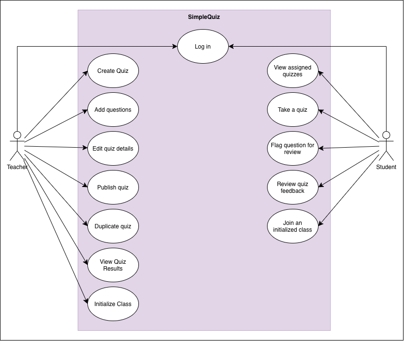
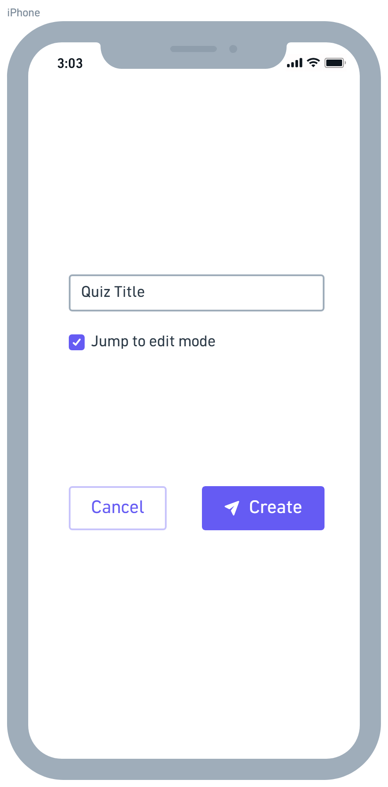
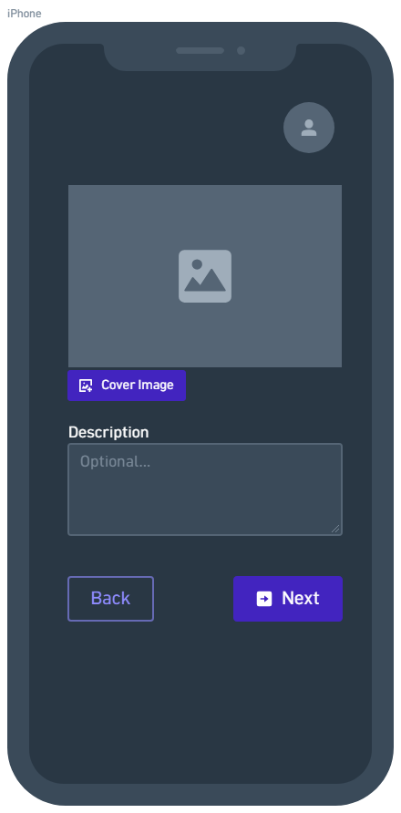
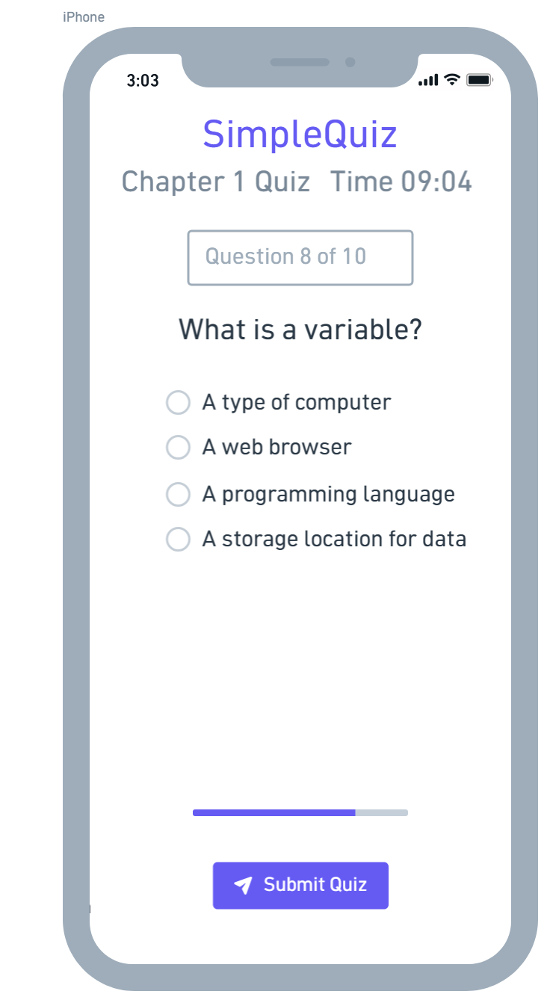
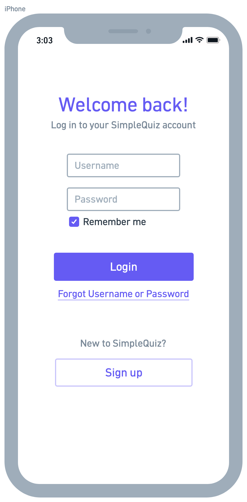
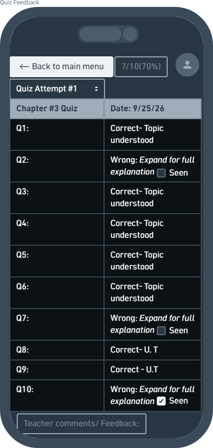
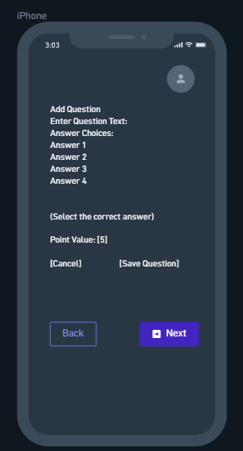
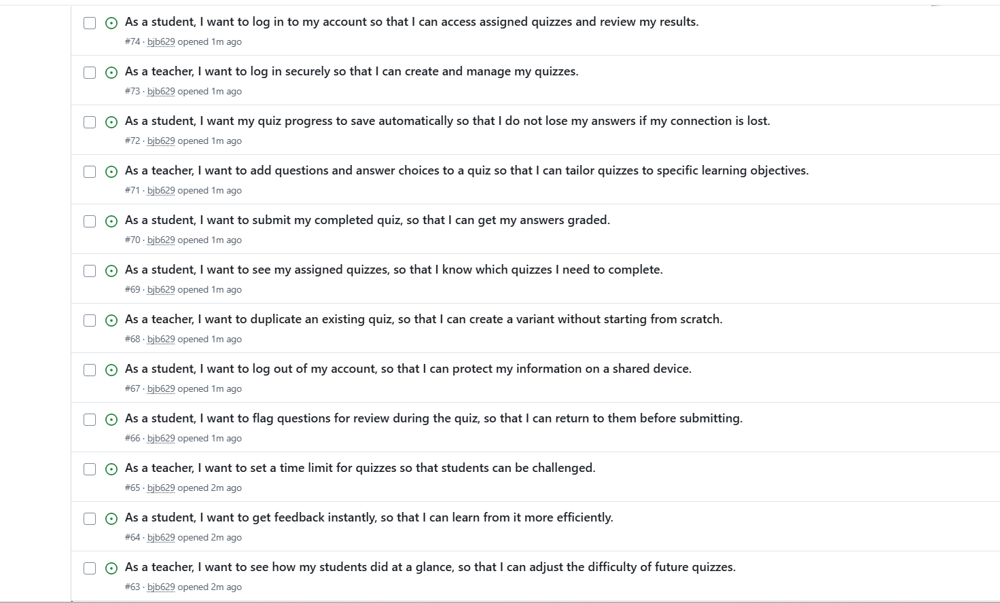

# D.2 Requirements
## 1. Positioning

### 1.1 Problem statement

| | |
|---|---|
| **The problem of** | overly complicated and poorly organized online quiz creation and management |
| **affects** | teachers who create quizzes and students who use them for studying|
| **the impact of which is** | teachers spending unnecessary time creating, organizing, and reusing quiz content, while students receive limited feedback and accessibility/usage problems across devices |

The problem of complicated and poorly organized online quiz creation and management affects teachers who create quizzes and students who use them; the impact of which is instructors spending unnecessary time managing quiz content while students receive limited feedback and experience accessibility and usability problems across devices.

### 1.2 Product Position Statement

| | |
|---|---|
| **For** | Teachers and their students |
| **Who** | need an efficient way to create, organize, complete, and review online quizzes |
| **The SimpleQuiz** | is an online quiz application |
| **That** | simplifies quiz creation and reuse while providing students with accessible quizzes, reviewable answers, and clear feedback |
| **Unlike** | complicated learning management system quiz tools like canvas and other study applications |
| **Our product** | combines efficient quiz creation tools for instructors with a simple, student-focused experience that works across devices |

For teachers and their students who need an efficient way to create, organize, deliver, complete, and review online quizzes, SimpleQuiz is an online quiz application that simplifies quiz creation and reuse while providing students with easy to make quizzes, reviewable answers, and clear feedback. Unlike some competing quiz tools that are overly complicated, our product combines efficient tools with a simple student-focused experience that works across devices.

### 1.3 Value proposition and customer segment

**Value proposition:** SimpleQuiz is an online quiz application that helps teachers and students create and reuse quizzes more efficiently while giving students an accessible and less stressful quiz experience with reviewable answers and clear feedback. Unlike other quiz tools, SimpleQuiz combines streamlined instructor workflows and a student-focused, cross-device experience in one application.

**Customer segment:** Teachers who regularly create and manage online quizzes, particularly teachers using learning management systems such as Canvas, and university students who take those quizzes to assess their knowledge and prepare for exams.

## 2. Functional requirements
### 2.1 Quiz management
1. [High] The system shall allow teachers to create, edit, draft, and delete quizzes.
2. [Medium] The system shall allow teachers to set quiz metadata, including title, description, and cover image.
3. [Medium] The system shall allow teachers to set quiz-level settings, including:
    * [Medium] Overall time limit.
    * [Low] Per-question time limit.
    * [Medium] Passing score threshold.
    * [Medium] Maximum allowed attempts per student.
    * [Low] Question and answer choice randomization.
4. [High] The system shall allow teachers to publish quizzes to make them accessible to students.

### 2.2 Question management
1. [High] The system shall support multiple question types, including:
    * [High] Multiple choice.
    * [Medium] Multiple select.
    * [High] True/false.
    * [Medium] Short answer.
2. [High] The system shall allow teachers to assign point values to questions.
3. [Low] The system shall allow teachers to attach multimedia assets to questions.

### 2.3 Quiz execution and submission
1. [High] The system shall display assigned quizzes and available attempts to logged-in students.
2. [Medium] The system shall display an active countdown timer during time-limited quiz attempts.
3. [Medium] The system shall automatically save student progress during an active quiz.
4. [High] The system shall automatically submit the quiz attempt when the time limit expires.
5. [High] The system shall allow students to select or enter answers for each quiz question.
6. [High] The system shall allow students to explicitly submit their completed quiz attempts. 

### 2.4 Grading and analytics
1. [High] The system shall automatically grade objective questions upon submission.
2. [Medium] The system shall display immediate scores and feedback explanations to students post-submission if enabled by the teacher.
3. [Low] The system shall provide teachers with aggregate class performance metrics and individual student attempt details.

## 3. Non-functional requirements
1. **Reliability - Maturity**  
   Requirement: The app must not crash during regular use.  
   Acceptance Criteria: The app completes 15 consecutive quiz attempts of length 10 questions (mixing multiple-choice, true/false, and short-answer questions) with no crashes. A crash is defined as the app becoming unresponsive for 5 or more seconds or the app closing unexpectedly.  

2. **Reliability - Recoverability**  
   Requirement: The app must properly save and store the user's exact quiz state.  
   Acceptance Criteria: After closing the app mid-quiz (4/10 questions have been answered and submitted) and reopening it, the user resumes at question 5 with all previous answers intact. Verified across 5 trials (5/5, 100% success rate).  

3. **Usability - Learnability**  
   Requirement: A new user is able to start a quiz without instructions.  
   Acceptance Criteria: Four out of five new users unfamiliar with the app can start and complete a quiz within 5 minutes with no additional help required.  

4. **Portability - Adaptability**  
   Requirement: App must function correctly on common student browsers and devices.  
   Acceptance Criteria: The MVP supports 6 browser/device combinations (Chrome/Windows, Safari/iOS, Chrome/Android, Firefox/macOS, Edge/Windows, Safari/macOS). Testing the five workflows (starting a quiz, answering questions, submitting a quiz, viewing results, and resuming a saved quiz) across all 6 combinations results in at least 90% of test cases passing with no visual bugs or broken functionality.  

5. **Performance Efficiency - Time Behavior**  
   Requirement: The app must respond quickly when a user submits an answer.  
   Acceptance Criteria: After a user submits an answer, the next question appears within 3 seconds, tested across 10 trials (multiple-choice, true/false, or short-answer questions) on a standard Wi-Fi connection.  

## 4. MVP

The MVP is a mobile web application that allows teachers to create and publish quizzes and students to take quizzes and review feedback. It implements the minimal end-to-end workflow: Login, quiz creation, adding objective questions, publishing, student quiz execution, and immediate feedback review. It does not implement secondary features such as Canvas integration, and quiz duplication.

### 4.1 Target Users
* **Teachers:** 1–2 university instructors or teaching assistants who currently administer weekly quizzes.
* **Students:** 10–20 undergraduate students enrolled in these courses.

### 4.2 Comparison Baseline
The baseline for comparison is the standard Canvas workflow currently used in these courses:
* **Instructor baseline:** Time required to construct and publish a 10-question multiple-choice quiz in Canvas.
* **Student baseline:** Rate of mobile completion and student feedback review interactions under Canvas.

### 4.3 Observable Outcomes
To empirically validate problem-solution fit and the value proposition, the MVP will measure:
1. **Creation Efficiency:** Instructors achieve at least a 35% reduction in total time spent creating and publishing a 10-question quiz compared to the Canvas baseline.
2. **Feedback Engagement:** At least 70% of students actively open and review their feedback post-submission, demonstrating measurable demand for this workflow.

### 4.4 Learning Decision
If both observable criteria are met, the value proposition holds. If not, a redesign or pivot will be necessary. 

## 5. Use cases
### 5.1 Use case diagram

### 5.2 Use case descriptions and interface sketch
#### 5.2.1 Use case: Create a quiz
**Actor:** Teacher  
**Description:** The teacher creates a new quiz.  
**Preconditions:** The teacher is already logged in to the system.  
**Post-conditions:** The quiz is registered in the system, but does not contain any questions yet.

**Main flow:**
1. The teacher specifies a title for the quiz.
2. The teacher instructs the system to register the new quiz.
3. The system validates the title.
4. The system registers the quiz.
5. The system informs the teacher of the success.
6. The system offers the teacher to start editing the quiz.

**Alternative flows:**
* <b> 2a. The teacher cancels the operation:</b>
    1. The system returns to the previous state.
* <b> 3a. The title is invalid because it is empty: </b>
    1. The system informs the teacher of the error.
    2. The system returns to step 1.
* <b> 4a. An error occurs while registering the quiz: </b>
    1. The system informs the teacher of the error.
    2. The system returns to step 1 while retaining the text, allowing the teacher to edit the title, try again, or cancel.

#### 5.2.2 Use case: Edit quiz details
**Actor:** Teacher  
**Description:** The teacher adds a cover image and description.  
**Preconditions:** The teacher is logged in and is in the process of creating or editing the quiz.  
**Post-conditions:** The cover image and/or description of the quiz are updated in the system.  

**Main flow:**
1. The teacher optionally uploads a cover image.
2. The teacher optionally provides a description for the quiz.
3. The teacher instructs the system to proceed to the next step.
4. The system validates the input data.
5. The system saves the quiz details.
6. The system advances the teacher to the next step.

**Alternative flows:**
* <b> 3a. The teacher cancels or goes back: </b>  
    1. The system returns to the previous state.  
* <b> 4a. An error occurs while uploading the image (invalid format or size limit exceeded): </b>  
    1. The system informs the teacher of the error.  
    2. The system returns to step 1 while retaining the description text, allowing the teacher to select a different image.
* <b> 4b.  An error occurs while saving the quiz details (word count exceeded): </b>  
    1. The system informs the teacher of the error.  
    2. The system returns to step 1 while retaining all entered inputs, allowing the teacher to try again.

#### 5.2.3 Use case: Take a quiz
**Actor:** Student  
**Description:** The student takes an assigned quiz.  
**Preconditions:** The student is logged in and has an assigned quiz available.  
**Post-conditions:** The quiz attempt is submitted and the student's score is available.  

**Main flow:**
1. The student views their assigned quizzes.
2. The student starts the quiz.
3. The student answers the quiz questions.
4. The student submits the quiz.
5. The system grades the quiz.
6. The student views their score.

**Alternative flows:**
* <b> 4a. The quiz time limit expires: </b>
    1. The system automatically submits the quiz.
    2. The system grades the quiz.
    3. The student views their score.
* <b> 3a. The student leaves the quiz before submitting: </b>
    1. The system saves the student's progress.
    2. The student can return to the quiz and continue answering questions.
* <b> 1a. The student has no attempts available: </b>
    1. The system informs the student that no attempts are available.
    2. The student cannot start the quiz.

#### 5.2.4 Use case: Log in
**Actor:** Teacher or student  
**Description:** The user authenticates with the system to access their quizzes and account features.  
**Preconditions:** The user has an account registered with the system.  
**Post-conditions:** The user is authenticated and the system displays the appropriate experience for their role.  

**Main flow:**
1. The user provides their account credentials.
2. The system validates the credentials.
3. The system authenticates the user.
4. The system starts a session for the user.
5. The system displays the appropriate teacher or student experience.

**Alternative flows:**
* <b> 2a. The credentials are invalid: </b>  
    1. The system informs the user that the credentials are invalid.
    2. The system allows the user to try again.
* <b> 2b. The account does not exist: </b>  
    1. The system informs the user that no matching account was found.
    2. The system offers the user the option to register or try again.
* <b> 2c. The user cancels the operation: </b>  
    1. The system returns the user to the previous state without creating a session.

#### 5.2.5 Use case: Review quiz feedback
**Actor:** Student  
**Description:** The student reviews the results and feedback for a quiz attempt they have completed.  
**Preconditions:** The student is logged in and has submitted at least one quiz attempt.  
**Post-conditions:** Feedback is marked as seen.

**Main flow:**
1. The student indicates they want to review their quiz results.
2. The system presents the student's completed attempts.
3. The student selects an attempt.
4. The system retrieves the attempt's results.
5. The system presents the overall score and, for each question, the student's answer, the correct answer, and the explanation.
6. The system presents the teacher's comments.
7. The student indicates they have finished reviewing.
8. The system marks the feedback as seen.

**Alternative flows:**
* <b>2a. The student has no completed attempts:</b>
    1. The system informs the student that there are no results to review.
* <b>4a. An error occurs while retrieving the results:</b>
    1. The system informs the student of the error.
    2. The system returns to step 2.
* <b>5a. The attempt is still awaiting grading (open-ended questions):</b>
    1. The system informs the student that feedback is not yet available and shows the grading status.
    2. The system returns to step 2.
* <b>5b. The teacher has chosen to hide correct answers:</b>
    1. The system presents only the score and the teacher's comments.
    2. The use case continues at step 6.

  

#### 5.2.6 Use case: Add questions to a quiz
**Actor:** Teacher  
**Description:** The teacher adds a question, answer choices, a correct answer, and a point value to a quiz.  
**Preconditions:** The teacher is logged in and is editing a quiz they created.  
**Post-conditions:** The new question is saved and added to the quiz.

**Main flow:**
1. The teacher chooses to add a new question.
2. The system displays the question form.
3. The teacher enters the question text.
4. The teacher enters the answer choices.
5. The teacher selects the correct answer.
6. The teacher assigns a point value to the question.
7. The system validates the entered information.
8. The system saves the question to the quiz.
9. The system displays the updated quiz.

**Alternative flows:**
* <b> 7a. The teacher cancels the operation: </b>
    1. The system returns to the quiz editor without adding the question.
* <b> 8a. Required information is missing or invalid: </b>
    1. The system informs the teacher of error.
    2. The system saves the entered information and lets the teacher make corrections.
* <b> 9a. An error occurs while saving the question: </b>
    1. The system informs the teacher that the question could not be saved.
    2. The system retains the entered information and allows the teacher to try again.

## 6. User stories
* As a teacher, I want to see how my students did at a glance, so that I can adjust the difficulty of future quizzes. 
    * Priority: High
    * Effort estimate: 5
* As a student, I want to get feedback instantly, so that I can learn from it more efficiently. 
    * Priority: High
    * Effort estimate: 3
* As a teacher, I want to set a time limit for quizzes so that students can be challenged.
    * Priority: Medium
    * Effort estimate: 2
* As a student, I want to flag questions for review during the quiz, so that I can return to them before submitting.
    * Priority: Low
    * Effort estimate: 2
* As a student, I want to log out of my account, so that I can protect my information on a shared device.
    * Priority: Low
    * Effort estimate: 1
* As a teacher, I want to duplicate an existing quiz, so that I can create a variant without starting from scratch. 
   * Priority: Medium
   * Effort estimate: 2
* As a student, I want to see my assigned quizzes, so that I know which quizzes I need to complete.
    * Priority: High
    * Effort estimate: 3
* As a student, I want to submit my completed quiz, so that I can get my answers graded.
    * Priority: High
    * Effort estimate: 3
* As a teacher, I want to add questions and answer choices to a quiz so that I can tailor quizzes to specific learning objectives.
    * Priority: High
    * Effort estimate: 8
* As a student, I want my quiz progress to save automatically so that I do not lose my answers if my connection is lost.
    * Priority: Medium
    * Effort estimate: 8  
* As a teacher, I want to log in securely so that I can create and manage my quizzes.
    * Priority: High
    * Effort estimate: 5
* As a student, I want to log in to my account so that I can access assigned quizzes and review my results.
    * Priority: High
    * Effort estimate: 1

## 7. Issue Tracker

## 8. Member participation
* Jonas Thumbs (@Jonas-Thumbs) - 15%: Wrote the use case "Create a quiz" and designed the UI. Specified the MVP, wrote two user stories and suggested the use of Whimsical as a tool for designing UI. 
* Cody Hess (@CodyHesss)
* Bella Broker (@bjb629) - 15% Wrote the use case "Take a quiz" and designed the UI, wrote two user stories, helped fill out the effort estimate, and did the Issue Tracker.
* Gustavo Avina (@naugoose)
* Annabelle Rodriguez (@annabellerod) - 15%: Wrote the use case "Log in" and designed the UI. Created the Use Case diagram, wrote two user stories, and reviewed the pull requests for this deliverable.
* Gus Cardenas (@gusc839) - 15%: Wrote the use case "Review quiz" and designed the UI. Created two user stories and wrote the non-functional requirements.
